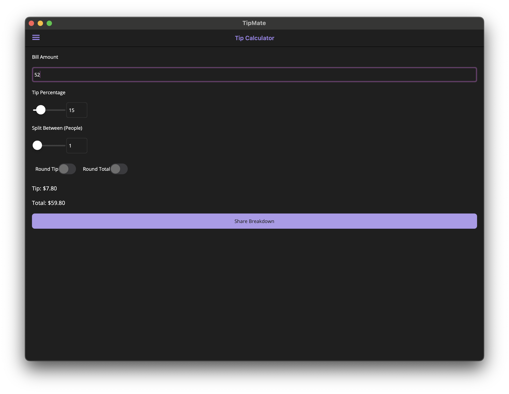

# TipMate 💸

**Cross-platform Tip Calculator built with .NET MAUI**  
Calculate tips, split bills, and round totals with ease while respecting your system’s default currency and theme.

## ✨ Features

- 💰 **Bill Input** with automatic system currency formatting
- 🎚️ **Tip Percentage Slider** with numeric entry
- 👥 **Split Between People** with live adjustment
- 🔄 **Rounding Option** for total amount
- 📱 **Responsive UI** for Android, iOS, Windows, and macOS
- 📤 **Share Breakdown** via native sharing options
- 🌓 **Dark Mode** support out of the box

## 📸 Preview



## 🚀 Getting Started

### Prerequisites

- [.NET 9 SDK](https://dotnet.microsoft.com/en-us/download)
- [Visual Studio 2022/2023](https://visualstudio.microsoft.com/) with **MAUI workload**

### Run Locally

```bash
git clone https://github.com/iNoles/TipMate.git
cd TipMate
dotnet build
dotnet maui run
```

## 🛠️ Tech Stack

- .NET MAUI
- CommunityToolkit.Maui for enhanced UI components
- System.Globalization for culture-aware formatting

## 🤝 Contributing
Pull requests are welcome! Feel free to open an issue for feature requests or bugs.
